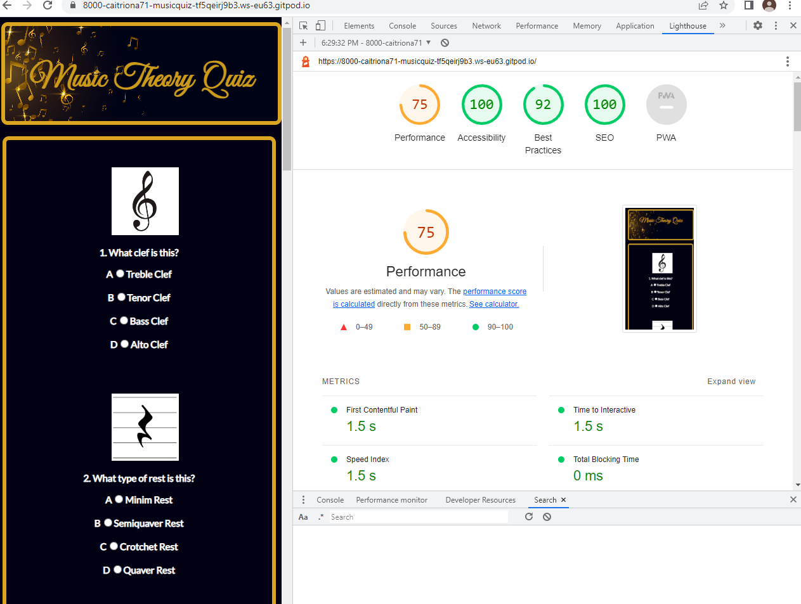

# **PROJECT 2 Music Quiz**
Music Quiz is a simple multiple choice answers music theory quiz with images.  It's aim is to test the user's knowledge of music theory.  
 

This is the live site: [music-quiz](https://caitriona71-musicquiz-tf5qeirj9b3.ws-eu63.gitpod.io/caitriona71/music-quiz/)>

## **Features**
A relevant header image, underneath this is a list of 10 questions with images displayed pertaining to each question together with four multiple choice answer options from which the user selects one answer.  A submit button for the user to submit his answers when quiz completed and alert messages telling the user their score and how well they did depending on how many questions they answered correctly.
 

## **Technologies Used**

* HTML
* CSS
* Javascript
* Gitpod
* GitHub
* [Google Fonts](https://fonts.google.com)
* [TinyPNG](https://tinypng.com)
* [AmIResponsive](https://ui.dev/amiresponsive)
* [webformatter.com](https://webformatter.com)

## **Future Improvements**

* Various levels of difficulty could be included.
## **Content**
Images from Clipart Library [http://clipart-library.com/]

## **Validator Testing**
## **Lighthouse** - The quiz was tested for performance using Lighthouse.

## **Acknowledgements**
* My Course Facilitator for his helpful advice, guidance and encouragement.  
* My mentor for his help and feedback.  
* Tutor Support at Code Institute.  
